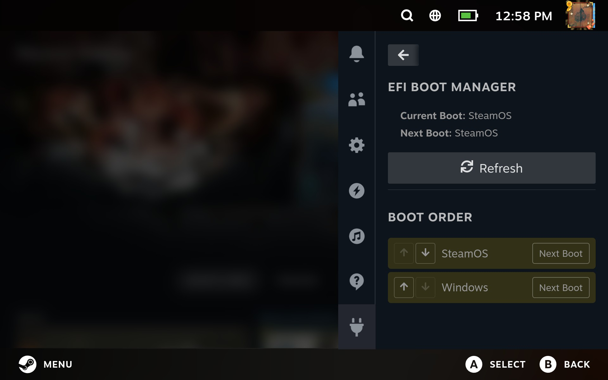

# EFI Boot Manager

[简体中文](README_CN.md) | English

A Decky plugin that provides a graphical interface for managing EFI boot entries on Steam Deck.



## Features

- **Visual Boot Order Management**: Reorder boot entries using intuitive up/down buttons
- **Set Next Boot**: Temporarily set a specific boot entry for the next reboot
- **Real-time Information**: Display current boot entry and next boot target
- **Filtered View**: Shows only SteamOS and Windows boot entries for cleaner interface
- **Multi-language Support**: Automatically detects and uses your Steam language setting

## Requirements

- Steam Deck running SteamOS
- Decky Loader installed
- EFI boot system (standard on Steam Deck)

## Installation

1. Install [Decky Loader](https://github.com/SteamDeckHomebrew/decky-loader) if you haven't already
2. Download the latest release from the Releases page
3. Install the plugin through Decky Loader's plugin browser or manually place the plugin folder in `~/homebrew/plugins/`

## Usage

1. Open the Decky menu (Quick Access → Decky icon)
2. Select "EFI Boot Manager" from the plugin list
3. View your current boot configuration:
   - **Current Boot**: The operating system you're currently running
   - **Next Boot**: The OS that will boot next (if set)
4. Reorder boot entries:
   - Use the up/down arrow buttons to change boot priority
   - Changes are saved automatically
5. Set next boot target:
   - Click the "Next Boot" button next to any entry to set it as the next boot target
   - This is temporary - after one reboot, it will revert to the boot order

## How It Works

This plugin is a GUI wrapper for the `efibootmgr` command-line tool. It:
- Runs with root privileges (via Decky's `_root` flag)
- Parses the output of `efibootmgr -v` to display boot information
- Uses `efibootmgr -o` to modify boot order
- Uses `efibootmgr -n` to set next boot target

## Supported Languages

- English
- 简体中文 (Simplified Chinese)

The plugin automatically detects your Steam language setting.

## Development

### Prerequisites

- Node.js v16.14+
- pnpm v9

### Building

```bash
# Install dependencies
pnpm install

# Build the plugin
pnpm run build

# Output will be in the 'out' directory
```

### Project Structure

```
.
├── src/
│   ├── index.tsx       # Main plugin UI
│   └── i18n.ts         # Internationalization setup
├── main.py             # Python backend (efibootmgr wrapper)
├── plugin.json         # Plugin metadata
└── package.json        # Node.js dependencies
```

## Contributing

Contributions are welcome! Please feel free to submit a Pull Request.

## License

This project is licensed under the BSD-3-Clause License - see the LICENSE file for details.

## Acknowledgments

- Based on the [Decky Plugin Template](https://github.com/SteamDeckHomebrew/decky-plugin-template)
- Uses [Decky Frontend Library](https://github.com/SteamDeckHomebrew/decky-frontend-lib)
- Inspired by various Decky plugins in the ecosystem

## Disclaimer

This plugin modifies EFI boot configuration. While it only changes boot order and next boot settings (which are safe operations), use at your own risk. Always ensure you have a way to recover your system if something goes wrong.
