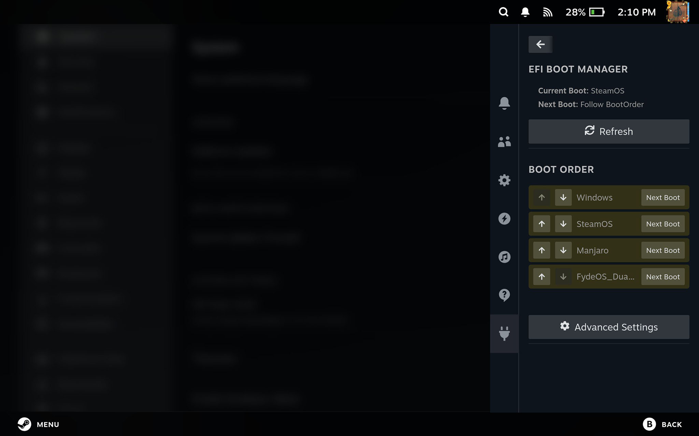
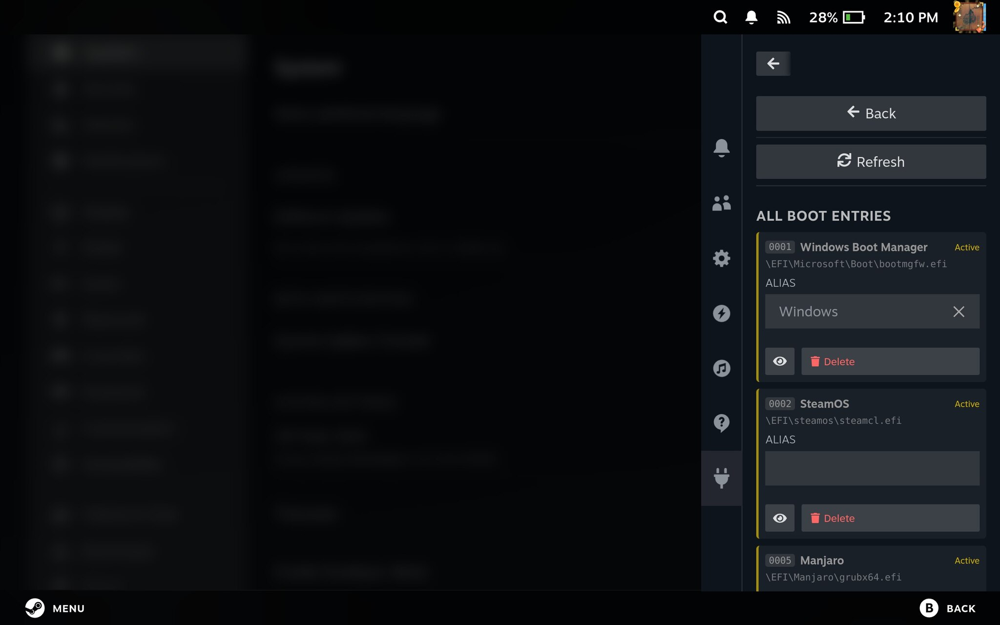

# EFI Boot Manager

[简体中文](README_CN.md) | English

A [Decky](https://decky.xyz/) plugin that provides a graphical interface for managing EFI boot entries on Steam Deck. Fully operable with gamepad controls.

## Screenshots

|                 Main Page                 |                 Advanced Settings                 |
| :---------------------------------------: | :-----------------------------------------------: |
|  |  |

## Features

- **Visual Boot Order Management**: Reorder boot entries using intuitive up/down buttons
- **Set Next Boot**: Temporarily set a specific boot entry for the next reboot
- **Real-time Information**: Display current boot entry and next boot target
- **Show All Boot Entries**: Displays all EFI boot entries including their boot number and EFI file path
- **Advanced Settings**:
  - **Alias**: Set custom display names for boot entries (e.g. rename "Windows Boot Manager" to "Windows")
  - **Show / Hide**: Toggle visibility of individual entries on the main page via eye icon
  - **Delete**: Remove unwanted EFI boot entries with confirmation dialog
  - **Auto-save**: All settings changes are saved automatically with debounce
- **Gamepad Support**: Full controller/gamepad navigation, optimized for Steam Deck's Game Mode
- **Multi-language Support**: Automatically detects and uses your Steam language setting (English, 简体中文)

## Requirements

- Steam Deck running SteamOS (or any Linux device with `efibootmgr`)
- [Decky Loader](https://github.com/SteamDeckHomebrew/decky-loader) installed
- EFI boot system (standard on Steam Deck)

## Installation

1. Install [Decky Loader](https://github.com/SteamDeckHomebrew/decky-loader) if you haven't already
2. Download the latest release from the [Releases](https://github.com/f-ever/decky-efibootmgr/releases) page
3. Extract the plugin to `~/homebrew/plugins/` and restart Decky Loader

## Usage

### Main Page

1. Open the Decky menu (Quick Access → Decky icon)
2. Select "EFI Boot Manager" from the plugin list
3. View your current boot configuration:
   - **Current Boot**: The operating system you're currently running
   - **Next Boot**: The OS that will boot next (if set, otherwise follows boot order)
4. Reorder boot entries:
   - Use the ↑/↓ arrow buttons to change boot priority
   - Changes are applied immediately
5. Set next boot target:
   - Press the "Next Boot" button next to any entry to set it as the next boot target
   - This is a one-time setting — after one reboot, it will revert to the default boot order

### Advanced Settings

1. Press the "Advanced Settings" button at the bottom of the main page
2. All EFI boot entries are displayed with their boot number (e.g. `0001`) and EFI file path
3. **Alias**: Enter a custom name in the text field to override the default label on the main page
4. **Visibility**: Click the eye icon to show/hide an entry on the main page
5. **Delete**: Remove a boot entry permanently (requires confirmation)
6. Press "Back" to return to the main page

## How It Works

This plugin is a GUI wrapper for the `efibootmgr` command-line tool. It:

- Runs with root privileges (via Decky's `_root` flag)
- Parses the output of `efibootmgr -v` to display boot information
- Uses `efibootmgr -o` to modify boot order
- Uses `efibootmgr -n` to set next boot target
- Uses `efibootmgr -b <num> -B` to delete boot entries
- Stores settings (aliases, visibility) in a JSON file under the plugin directory

## Development

### Prerequisites

- Node.js v16.14+
- pnpm v9

### Building

```bash
# Install dependencies
pnpm install

# Build the plugin
pnpm run build

# Output will be in the 'out' directory
```

### Project Structure

```text
.
├── src/
│   ├── index.tsx              # Main plugin UI
│   ├── advancedSettings.tsx   # Advanced settings panel
│   ├── utils.ts               # Shared types & helpers
│   └── i18n.ts                # Internationalization
├── main.py                    # Python backend (efibootmgr wrapper)
├── py_modules/
│   └── plugin_settings.py     # Settings persistence
├── plugin.json                # Plugin metadata
└── package.json               # Node.js dependencies
```

## Contributing

Contributions are welcome! Please feel free to submit a Pull Request.

## License

This project is licensed under the BSD-3-Clause License - see the [LICENSE](LICENSE) file for details.

## Acknowledgments

- Based on the [Decky Plugin Template](https://github.com/SteamDeckHomebrew/decky-plugin-template)
- Uses [Decky Frontend Library (@decky/ui)](https://github.com/SteamDeckHomebrew/decky-frontend-lib)

## Disclaimer

This plugin modifies EFI boot configuration. While it only changes boot order and next boot settings (which are safe operations), use at your own risk. The **delete** function permanently removes EFI boot entries — use with caution. Always ensure you have a way to recover your system if something goes wrong.
