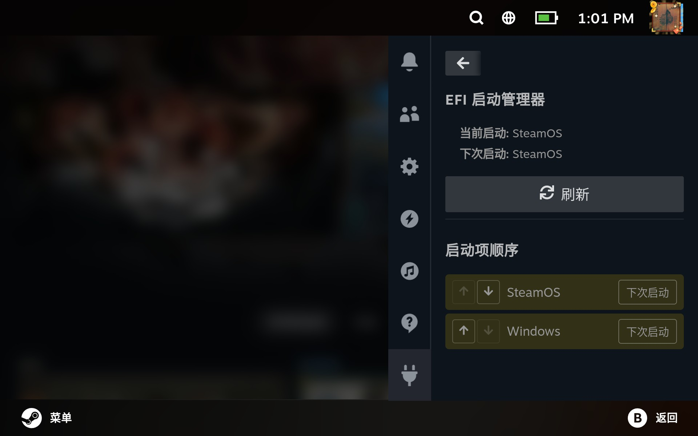

# EFI 启动管理器、

简体中文 | [English](README.md)

一个为 Steam Deck 提供图形化界面管理 EFI 启动项的 Decky 插件。



## 功能特性

- **可视化启动顺序管理**：使用直观的上下按钮重新排列启动项
- **设置下次启动**：临时设置特定启动项为下次重启目标
- **实时信息显示**：显示当前启动项和下次启动目标
- **过滤视图**：仅显示 SteamOS 和 Windows 启动项，界面更简洁
- **多语言支持**：自动检测并使用你的 Steam 语言设置

## 系统要求

- 运行 SteamOS 的 Steam Deck
- 已安装 Decky Loader
- EFI 启动系统（Steam Deck 标配）

## 安装方法

1. 如果尚未安装，请先安装 [Decky Loader](https://github.com/SteamDeckHomebrew/decky-loader)
2. 从 Releases 页面下载最新版本
3. 通过 Decky Loader 的插件浏览器安装，或手动将插件文件夹放置到 `~/homebrew/plugins/`

## 使用方法

1. 打开 Decky 菜单（快速访问 → Decky 图标）
2. 从插件列表中选择"EFI 启动管理器"
3. 查看当前启动配置：
   - **当前启动**：你当前正在运行的操作系统
   - **下次启动**：下次将要启动的操作系统（如果已设置）
4. 重新排序启动项：
   - 使用上下箭头按钮更改启动优先级
   - 更改会自动保存
5. 设置下次启动目标：
   - 点击任意启动项旁边的"下次启动"按钮将其设置为下次启动目标
   - 这是临时设置 - 重启一次后将恢复为启动顺序设置

## 工作原理

本插件是 `efibootmgr` 命令行工具的图形化封装。它：
- 以 root 权限运行（通过 Decky 的 `_root` 标志）
- 解析 `efibootmgr -v` 的输出来显示启动信息
- 使用 `efibootmgr -o` 修改启动顺序
- 使用 `efibootmgr -n` 设置下次启动目标

## 支持的语言

- English（英语）
- 简体中文

插件会自动检测你的 Steam 语言设置。

## 开发

### 前置要求

- Node.js v16.14+
- pnpm v9

### 构建

```bash
# 安装依赖
pnpm install

# 构建插件
pnpm run build

# 输出文件在 'out' 目录中
```

### 项目结构

```
.
├── src/
│   ├── index.tsx       # 主插件 UI
│   └── i18n.ts         # 国际化设置
├── main.py             # Python 后端（efibootmgr 封装）
├── plugin.json         # 插件元数据
└── package.json        # Node.js 依赖
```

## 贡献

欢迎贡献！请随时提交 Pull Request。

## 许可证

本项目采用 BSD-3-Clause 许可证 - 详见 LICENSE 文件。

## 致谢

- 基于 [Decky 插件模板](https://github.com/SteamDeckHomebrew/decky-plugin-template)
- 使用 [Decky 前端库](https://github.com/SteamDeckHomebrew/decky-frontend-lib)
- 受 Decky 生态系统中各种插件的启发

## 免责声明

本插件会修改 EFI 启动配置。虽然它只更改启动顺序和下次启动设置（这些都是安全操作），但使用风险自负。请始终确保你有方法在出现问题时恢复系统。
