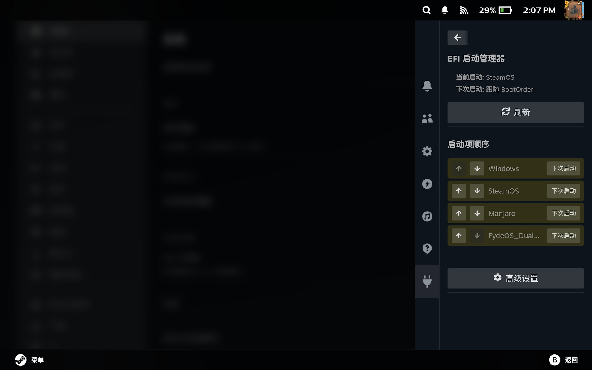
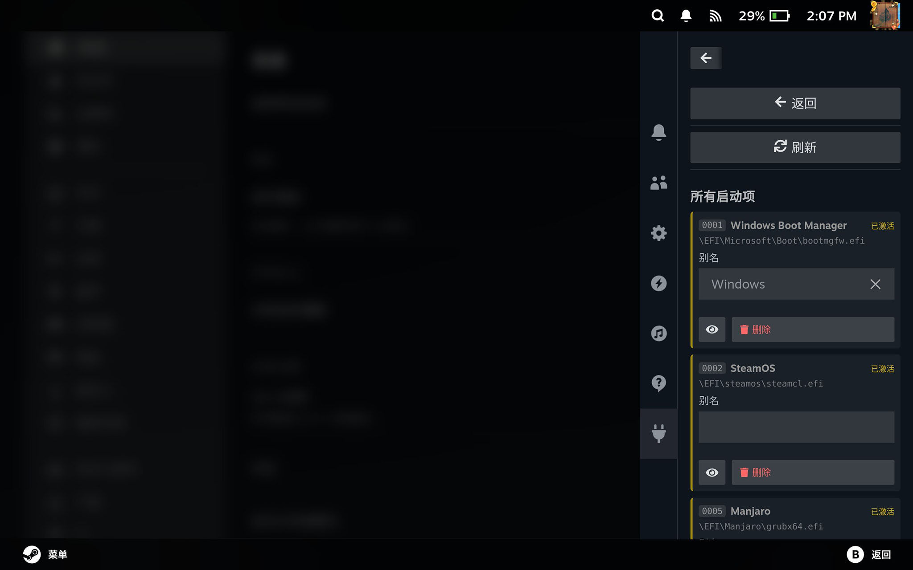

# EFI 启动管理器

简体中文 | [English](README.md)

一个为 Steam Deck 提供图形化界面管理 EFI 启动项的 [Decky](https://decky.xyz/) 插件。完全支持手柄操控。

## 截图

|                  主页面                   |                  高级设置                   |
| :---------------------------------------: | :-----------------------------------------: |
|  |  |

## 功能特性

- **可视化启动顺序管理**：使用直观的上下按钮重新排列启动项
- **设置下次启动**：临时设置特定启动项为下次重启目标
- **实时信息显示**：显示当前启动项和下次启动目标
- **显示全部启动项**：显示所有 EFI 启动项，包括启动编号和 EFI 文件路径
- **高级设置**：
  - **别名**：为启动项设置自定义显示名称（例如将 "Windows Boot Manager" 重命名为 "Windows"）
  - **显示 / 隐藏**：通过眼睛图标切换各启动项在主页面的显示状态
  - **删除**：删除不需要的 EFI 启动项（需确认）
  - **自动保存**：所有设置更改均自动保存（防抖处理）
- **手柄支持**：完整的手柄/控制器导航，针对 Steam Deck 游戏模式优化
- **多语言支持**：自动检测并使用你的 Steam 语言设置（English、简体中文）

## 系统要求

- 运行 SteamOS 的 Steam Deck（或任何安装了 `efibootmgr` 的 Linux 设备）
- 已安装 [Decky Loader](https://github.com/SteamDeckHomebrew/decky-loader)
- EFI 启动系统（Steam Deck 标配）

## 安装方法

1. 如果尚未安装，请先安装 [Decky Loader](https://github.com/SteamDeckHomebrew/decky-loader)
2. 从 [Releases](https://github.com/f-ever/decky-efibootmgr/releases) 页面下载最新版本
3. 将插件解压到 `~/homebrew/plugins/`，然后重启 Decky Loader

## 使用方法

### 主页面

1. 打开 Decky 菜单（快速访问 → Decky 图标）
2. 从插件列表中选择"EFI 启动管理器"
3. 查看当前启动配置：
   - **当前启动**：你当前正在运行的操作系统
   - **下次启动**：下次将要启动的操作系统（如已设置，否则跟随启动顺序）
4. 重新排序启动项：
   - 使用 ↑/↓ 箭头按钮更改启动优先级
   - 更改立即生效
5. 设置下次启动目标：
   - 按下任意启动项旁边的"下次启动"按钮将其设置为下次启动目标
   - 这是一次性设置 - 重启一次后将恢复为默认启动顺序

### 高级设置

1. 在主页面底部按下"高级设置"按钮
2. 显示所有 EFI 启动项及其启动编号（如 `0001`）和 EFI 文件路径
3. **别名**：在文本框中输入自定义名称，可覆盖主页面上的默认标签
4. **显示/隐藏**：点击眼睛图标切换该启动项在主页面的显示状态
5. **删除**：永久删除启动项（需确认操作）
6. 按"返回"回到主页面

## 工作原理

本插件是 `efibootmgr` 命令行工具的图形化封装。它：

- 以 root 权限运行（通过 Decky 的 `_root` 标志）
- 解析 `efibootmgr -v` 的输出来显示启动信息
- 使用 `efibootmgr -o` 修改启动顺序
- 使用 `efibootmgr -n` 设置下次启动目标
- 使用 `efibootmgr -b <编号> -B` 删除启动项
- 将设置（别名、显示状态）存储在插件目录下的 JSON 文件中

## 开发

### 前置要求

- Node.js v16.14+
- pnpm v9

### 构建

```bash
# 安装依赖
pnpm install

# 构建插件
pnpm run build

# 输出文件在 'out' 目录中
```

### 项目结构

```text
.
├── src/
│   ├── index.tsx              # 主插件 UI
│   ├── advancedSettings.tsx   # 高级设置面板
│   ├── utils.ts               # 共享类型与工具函数
│   └── i18n.ts                # 国际化
├── main.py                    # Python 后端（efibootmgr 封装）
├── py_modules/
│   └── plugin_settings.py     # 设置持久化
├── plugin.json                # 插件元数据
└── package.json               # Node.js 依赖
```

## 贡献

欢迎贡献！请随时提交 Pull Request。

## 许可证

本项目采用 BSD-3-Clause 许可证 - 详见 [LICENSE](LICENSE) 文件。

## 致谢

- 基于 [Decky 插件模板](https://github.com/SteamDeckHomebrew/decky-plugin-template)
- 使用 [Decky 前端库 (@decky/ui)](https://github.com/SteamDeckHomebrew/decky-frontend-lib)

## 免责声明

本插件会修改 EFI 启动配置。虽然它只更改启动顺序和下次启动设置（这些都是安全操作），但使用风险自负。**删除**功能将永久移除 EFI 启动项，请谨慎操作。请始终确保你有方法在出现问题时恢复系统。
